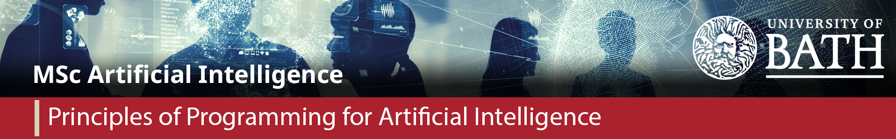

<!-- PROJECT SHIELDS -->
<!--
*** I'm using markdown "reference style" links for readability.
*** Reference links are enclosed in brackets [ ] instead of parentheses ( ).
*** See the bottom of this document for the declaration of the reference variables
*** for contributors-url, forks-url, etc. This is an optional, concise syntax you may use.
*** https://www.markdownguide.org/basic-syntax/#reference-style-links
-->
[![Stargazers][stars-shield]][stars-url]
[![MIT License][license-shield]][license-url]
[![LinkedIn][linkedin-shield]][linkedin-url]

<!-- PROJECT LOGO -->
 

    

<h2 align="center">MSc Artificial Intelligence</h2>
<h3 align="center">Principals of Programming</h3>

<!-- TABLE OF CONTENTS -->

  
Table of Contents

  <ol>
    <li>
      <a href="#about-the-project">About The Project</a>
      <ul>
        <li><a href="#built-with">Built With</a></li>
      </ul>
    </li>
    <li><a href="#license">License</a></li>
    <li><a href="#contact">Contact</a></li>
    <li><a href="#acknowledgments">Acknowledgments</a></li>
  </ol>

<!-- ABOUT THE PROJECT -->
## Introduction to Your Task

Cryptography is the practice of encoding secret messages such that they are only readable by the intended recipient and not anyone who intercepts it. This has been studied since ancient times but was vastly accelerated in the first half of the twentieth century for military use during World War I and World War II. This is for obvious reasons – armies need to communicate plans and intelligence throughout their hierarchies. Any means of sending a message in plain text is liable to be intercepted by an enemy. But if you can encode your message so that even the messenger doesn't understand it then this could help tip the balance of a conflict.

At the same time that nations were developing more secure codes and ciphers, they were also working around the clock to try to break the codes of their enemies. An especially strong opportunity arose once armies had started using radios to transmit their messages. Radio signals are easily intercepted, so if you can break the code you can lay bare the plans of your opponent.

The most well-known story of code breaking in the modern age concerns a machine that was first built by a German engineer at the end of World War I called the Enigma machine. Initially conceived for commercial use, the German military adopted and used the machine shortly before and during World War II. The British military were able to get hold of one of the commercial machines, so they knew the basics of how it worked; meanwhile, codebreakers in Poland had managed to crack some of the mechanics without one.

In 1938, the head of the British secret intelligence bought the mansion and land of what is now known as Bletchley Park. This became the home of the UK's code-breaking efforts during World War II, where cracking the Enigma code became a priority. Over the years of the war the mathematicians and codebreakers, most famously Gordon Welchman and Alan Turing, managed to crack the harder variants of the Enigma machine. Some experts estimate that the British military's covert knowledge of German messages shortened the war by at least two years.

You can learn more about the history of the machine online or even visit Bletchley Park, which is now a museum.

The tasks for this assignment will be explained in more detail in the accompanying Jupyter notebook. First, let's explain how the Enigma machine itself works, which you will need to know to be able to complete the assignment.

(<a href="#top">back to top</a>)

<!-- The Enigma machine-->
## The Enigma machine

Here is a picture of the Enigma machine:

an enigma machine

To encode a message, you press a key on the keyboard, which lights up one of the bulbs to indicate the encoded letter. You repeat this process for each character in your message. The machine has the usual 26 characters from A to Z.

The machine itself is really just a battery connected to several bulbs through switches, not unlike the most basic circuit diagrams you may have seen in school. What makes it complicated is the wiring itself: the route from the battery to the bulb goes through many transformations, and the route changes each time a key is pressed. This means that Enigma is unlike simple substitution ciphers – on the first key press, A might encode into G, but on the next key press, A might encode into W.

Another interesting property of the Enigma machine is that the same machine was used for encoding and decoding. So if you reset the machine to the same settings that turned AA into GW, and pressed the keys GW, you would get the message AA back.

There were many variants of the Enigma machine, but the basic components were the keyboard, the plugboard, the rotors, a reflector and the lampboard. The plugboard could connect different letters, swapping their values from the keyboard. Then each rotor would transform the letter again, the signal would pass through a reflector, go back through the rotors, back through the plugboard, and then finally light up a lamp.

To encode a message, you needed to know the settings. There were five rotors that had different wirings. Of these, three were inserted into the machine. Each rotor had 26 starting positions, which varied per message. Finally, the plugboard allowed for up to 10 pairs of characters to be connected with leads – it is possible to connect all 13 pairs, but the machine only came with 10 leads.

When the key is pressed, the rightmost rotor is rotated one position. When the rotor reaches a particular value, this rolls over to the next rotor to the left. So, if you imagine a three-rotor model, every time the right rotor makes a full rotation, the middle rotor moves one position. Every time the middle rotor makes a full rotation, the left rotor moves one position. The exact mechanics of this will be explained later.

You can see a video of the machine in action here:

<iframe width="400" height="225" src="https://www.youtube.com/embed/G2_Q9FoD-oQ" title="YouTube video player" frameborder="0" allow="accelerometer; autoplay; clipboard-write; encrypted-media; gyroscope; picture-in-picture" allowfullscreen></iframe>

## Enigma wiring

Here is a diagram adapted from Wikimedia which shows a simplified circuit assuming only four characters: 

the wiring of an enigma machine

[Source]

To follow the steps in order by their label on the diagram:

1. The battery supplies a current.
2. The operator presses the A key.
3. The current flows, 'sending' an A to the plugboard – there is no lead connected to A, so this remains an A.
4. An A is sent to the rotors through the entry board.
5. At each rotor, the A is exchanged for another character: in this four-character simplification, at each rotor from right to left:
   - A becomes F
   - then F becomes D
   - then D becomes A
6. Now, the reflector maps back through the entire circuit again: A becomes F, and this is passed back through the rotors, from left to right:
   - F becomes S
   - S becomes A
   - and A becomes S
7. S is sent to the plugboard, which this time has a lead connected.
8. So S is exchanged for D through the lead.
9. Finally, the D bulb is lit up.

If you follow the diagram, you can see that, if we had pressed the D switch instead, then the A bulb would have lit up. Imagine this circuit with all 26 characters, with variable rotor wiring, positions, and plugboard leads, and you have your full standard Enigma machine that we will use in this assignment.

## Code breaking

One thing you might notice from the machine's design is that a letter can never encode into itself. The German military thought this was a strength – intuitively, you might worry if a letter was not changed in your message because, then, part of the message might be easier to guess. But this turned out to be the machine's biggest weakness because it meant code breakers who had cracked part of the code could rule out various combinations which would cause letters to encode into themselves.

For Part 2 of this assignment, you will not have to employ the sophisticated codebreaking techniques that were used in Bletchley Park. More detail is provided in the Jupyter notebook for your submission. If you are interested in learning more about these codebreaking methods, there is another video available here:

<iframe width="400" height="225" src="https://www.youtube.com/embed/V4V2bpZlqx8" title="YouTube video player" frameborder="0" allow="accelerometer; autoplay; clipboard-write; encrypted-media; gyroscope; picture-in-picture" allowfullscreen></iframe>

# The Task

This assignment has two parts.
- In Part 1, you will build a simulation of an Enigma machine in Python.
- In Part 2, you will use your simulation to try to crack some codes that have we have produced.
- Marks are based on a mixture of automated testing, manual testing and code review. 
- For the code review part, consider the following points:
  - Code must be readable. This includes clear use of variables and function names, and appropriate commenting. Comments alone are not worth marks, but if the lack of comments or too many comments makes your code hard to read, you will be marked down.
  - In addition, code must otherwise be of high quality. This includes writing efficient algorithms with appropriate use of data structures, appropriate use of object-oriented programming design principles like polymorphism, correct use and structure of functions, the use of error handling and writing robust code, and so on.
  - Getting the highest marks on this assignment will require taking some initiative and going beyond the specification, and 20% of the overall marks are allocated for this purpose. This could include a demonstration of more advanced codebreaking, adapting the machine to work for different types of machine, or any other feature which you think demonstrates your programming ability. Academic excellence requires being able to produce unguided work and to be able to write about it clearly. You will be required to write about your extensions and experiments as part of the submission.
  - The marks for the two parts are split equally, though Part 2 has less guidance. So the full breakdown is:
    - Enigma machine simulation (40%)
    - Codebreaking using your simulation (40%)
    - Advanced extensions (20%)

### Built With

* [Python 3](https://www.python.org/)

(<a href="#top">back to top</a>)

<!-- LICENSE -->
## License

The author of this work asserts that all possible rights are reserved and does not grant any licence for the reuse or distribution of this work

(<a href="#top">back to top</a>)

<!-- CONTACT -->
## Contact

Your Name - [@earlution](https://twitter.com/earlution)

Project Link: [https://github.com/earlution/enigma-machine](https://github.com/earlution/enigma-machine)

(<a href="#top">back to top</a>)

<!-- ACKNOWLEDGMENTS -->
## Acknowledgments

* [Othniel Drew's Best_README-Template](https://github.com/othneildrew/Best-README-Template)

(<a href="#top">back to top</a>)

<!-- MARKDOWN LINKS & IMAGES -->
<!-- https://www.markdownguide.org/basic-syntax/#reference-style-links -->
[stars-shield]: https://img.shields.io/github/stars/github_username/repo_name.svg?style=for-the-badge
[stars-url]: https://github.com/earlution/msc-ai-pop/stargazers
[license-shield]: https://img.shields.io/github/license/earlution/repo_name.svg?style=for-the-badge
[license-url]: https://github.com/earlution/msc-ai-pop/blob/master/LICENSE.txt
[linkedin-shield]: https://img.shields.io/badge/-LinkedIn-black.svg?style=for-the-badge&logo=linkedin&colorB=555
[linkedin-url]: https://linkedin.com/in/linkedin_username
